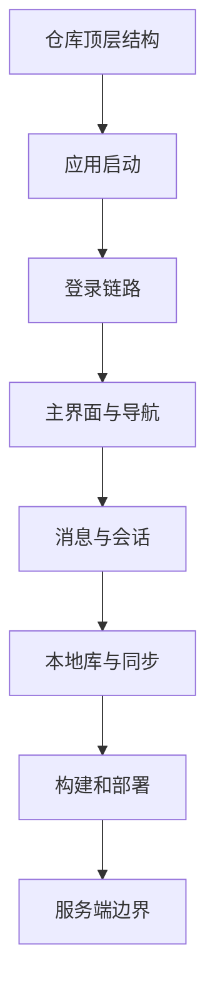

# 阅读指南

## 1. 一句话看懂项目

这就是一个“聊天是主线、钱包和音视频是增强能力”的 iOS 原生 IM 客户端工程。

它不是：

- 不是 Web 单页应用
- 不是前后端 Monorepo
- 不是只有聊天功能的极简 Demo
- 不是用 Pod / SPM 管理依赖的现代轻量工程

它更像：

- 一个长期演进过的 Objective-C 客户端
- 一个交付型源码包
- 一个把 HTTP、IM、推送、音视频、SQLite 都揉在一起的移动端业务工程

## 2. 先从哪里看

### 如果你是新开发者

按这个顺序看：

1. `main.m`
2. `AppDelegate.m`
3. `gui/login/LoginViewController.m`
4. `gui/login/impl/IMServerConnector.m`
5. `gui/main/MainTabsViewController.m`
6. `manager/IMClientManager.m`
7. `network/im/ChatBaseEventImpl.m`
8. `network/im/ChatMessageEventImpl.m`
9. `manager/SyncManager.m`
10. `sqlite/MyDataBase.m`

### 如果你要查“为什么登不上”

先看：

- `Default.h`
- `LoginViewController.m`
- `IMServerConnector.m`
- `ChatBaseEventImpl.m`

### 如果你要查“为什么消息或未读不对”

先看：

- `ChatMessageEventImpl.m`
- `ChatDataHelper.m`
- `GChatDataHelper.m`
- `MessagesProvider.m`
- `GroupsMessagesProvider.m`
- `AlarmsProvider.m`
- `SyncManager.m`

### 如果你要查“为什么工程跑不起来”

先看：

- `RainbowChat4i.xcodeproj/project.pbxproj`
- `Default.h`
- `Info.plist`
- `RainbowChat4i.entitlements`
- `RainbowChat4i-Debug.entitlements`

## 3. 建议的理解顺序

## 4. 读代码时的脑图

### 顶层问题 1：应用怎么启动

看 `main.m` 和 `AppDelegate.m`。

### 顶层问题 2：登录成功后怎么进主界面

看 `LoginViewController.m`、`IMServerConnector.m`、`ChatBaseEventImpl.m`。

### 顶层问题 3：主界面有哪些一级模块

看 `MainTabsViewController.m`。

### 顶层问题 4：页面怎么刷新数据

看 `IMClientManager.m`、各种 `Provider`、`NSMutableArrayObservableEx`、`NotificationCenterFactory`。

### 顶层问题 5：消息从哪来、存到哪、未读怎么算

看 `ChatMessageEventImpl.m`、`ChatDataHelper.m`、`MessagesProvider.m`、`AlarmsProvider.m`、`sqlite/*`、`SyncManager.m`。

## 5. 本仓库最容易误判的点

| 容易误判的地方 | 实际情况 |
| --- | --- |
| 目录里应该有服务端源码 | 当前 checkout 没有 `RainbowChatServer/` |
| 会话列表应该直接查消息表得到 | 不是，首页主要靠 `AlarmsProvider + alarms_history + 26-7 接口` |
| 登录成功就是应用准备好了 | 不是，HTTP 登录成功后还要完成 IM 登录和补齐动作 |
| 这是标准 TabBar 项目 | 不是，主容器兼容传统 TabBar 和自定义 FabBar |
| 依赖应该能用 Pod 安装 | 不是，当前是手工集成模式 |

## 6. 推荐的 Wiki 使用方式

- 日常开发：把本目录当“定位索引”。
- 排障：先查链路图，再去看代码。
- 新功能设计：先看模块边界，再决定改 UI、Provider、网络还是 SQLite。
- 交接：先过 `01`、`02`、`03`、`04` 四篇，基本能建立全局认知。

