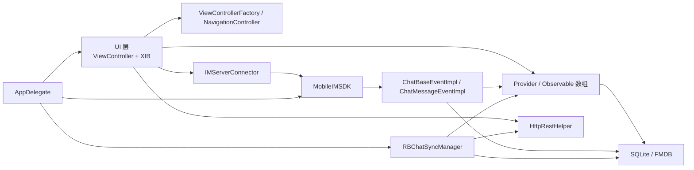
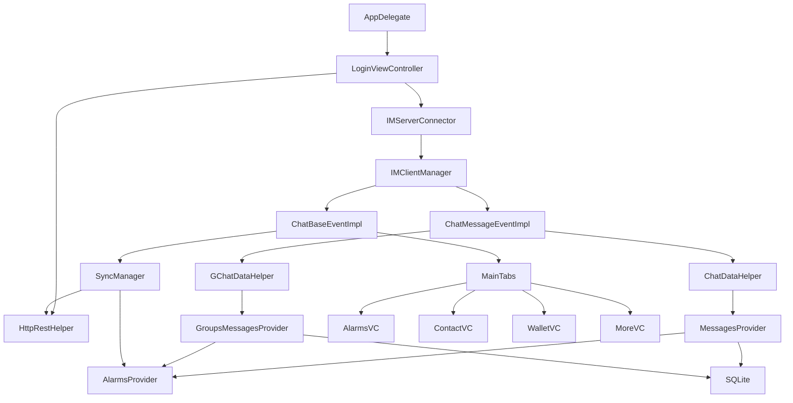

# 项目概览与架构

## 1. 项目定位

`自定义导航版本` 当前仓库的真实核心，是一个原生 iOS 即时通讯客户端工程 `RainbowChat4i`。

从业务形态看，它不是只做聊天列表和文本消息，而是一个带下面这些能力的复合型客户端：

- 登录与自动登录
- 单聊、群聊、临时会话
- 会话列表、未读、置顶、归档、@我
- 通讯录、加好友、好友申请、群列表
- 搜索、发现、朋友圈/附近等扩展页面
- 钱包、红包、转账、TRX 相关页面
- 语音、图片、文件、短视频
- 音视频通话、CallKit、VoIP Push
- 本地缓存、离线拉取、增量同步

## 2. 系统定位

| 维度 | 结论 |
| --- | --- |
| 产品形态 | 即时通讯客户端 |
| 技术形态 | 原生 iOS App |
| UI 形态 | UIKit + XIB，少量 Swift 组件 |
| 网络形态 | HTTP + IM 长连接双通道 |
| 数据形态 | Provider 内存状态 + SQLite 本地持久化 |
| 工程形态 | Xcode 手工集成依赖工程 |
| 代码风格 | Objective-C 历史工程，局部增量现代化 |
| 交付属性 | 强配置、强依赖、强环境绑定的交付型源码包 |

## 3. 技术栈

### 3.1 语言与 UI

- Objective-C 为主
- 少量 Swift 混编
- UIKit + XIB 为主
- 主导航兼容传统 TabBar 和自定义 FabBar

### 3.2 网络与协议

- HTTP 统一入口：`HttpRestHelper`
- IM 长连接入口：`LocalDataSender` + `ChatBaseEventImpl` + `ChatMessageEventImpl`
- 同步补偿：`QueryOfflineChatMsgAsync` + `RBChatSyncManager`

### 3.3 本地数据与状态

- SQLite / FMDB 队列封装
- Provider 持有内存态
- `NSNotificationCenter` + 自定义可观察数组推动 UI 刷新

### 3.4 三方能力

- MobileIMSDK
- AFNetworking
- FMDB
- Agora RTC
- AMap
- CallKit / PushKit
- JSQMessages / Masonry / SDWebImage 等

## 4. 架构风格

这个项目不是严格意义上的 MVVM、Redux、Clean Architecture。

它更接近下面这种传统移动端分层：

```text
ViewController
  -> Provider / Manager
  -> HTTP Helper / IM Event
  -> SQLite Table
```

也可以理解成：

- `ViewController` 负责页面和交互
- `Provider` 负责页面需要的内存数据
- `Manager` 负责全局运行时能力
- `network/*` 负责网络收发和回调
- `sqlite/*` 负责本地落地

## 5. 总体架构图



## 6. 顶层目录结构

```text
自定义导航版本/
├── RainbowChat4i/                  # iOS 客户端源码
├── RainbowChat4i.xcodeproj/        # Xcode 工程与构建配置
├── Resources/                      # 图片和静态资源
├── docs/code-wiki/                 # 当前 Wiki
├── Thirdpart/                      # 手工引入的第三方依赖
├── MT47_MT50_MT51_前端对接文档.md    # 群相关协议文档
└── 单机无漫游前端对接.md             # 单机无漫游运行模式说明
```

## 7. `RainbowChat4i/` 目录职责

| 目录 | 职责 | 备注 |
| --- | --- | --- |
| `gui/` | 页面控制器、页面级逻辑、部分业务 Provider | 业务最重 |
| `network/http/` | HTTP 请求网关、异步查询任务 | 所有业务接口都从这里过 |
| `network/im/` | IM 事件、消息发送、QoS、回执处理 | 实时链路核心 |
| `manager/` | 全局运行时管理器、同步、重连、服务地址 | 生命周期关键层 |
| `sqlite/` | 本地数据库、表结构、迁移、查询更新 | 离线与恢复核心 |
| `dto/` | HTTP / IM 数据模型 | 传输对象层 |
| `cache/` | 全局缓存和部分 Provider | 辅助状态层 |
| `common/` | 通用 UI、工具类、分类、通知工厂 | 公共基础层 |
| `qrcode/` | 二维码生成与解析 | 扩展功能 |

## 8. `gui/` 业务分区

```text
gui/
├── alarms/         # 会话列表、首页消息聚合
├── chat_friend/    # 单聊
├── chat_group/     # 群聊
├── chat_guest/     # 临时会话/游客会话
├── chat_root/      # 聊天公共底座、输入栏、表情、回执、通话
├── contact/        # 通讯录、好友申请、群入口
├── discover/       # 发现、AI、附近、朋友圈类页面
├── login/          # 登录、自动登录、IM 登录桥接
├── main/           # 主导航、根容器、Tab 装配
├── more/           # 我的、设置、资料、收藏等
├── profile/        # 用户资料、头像、相册、语音资料
├── register/       # 注册
├── search/         # 搜索入口与聚合搜索结果
└── wallet/         # 钱包、账单、转账相关页面
```

## 9. 关键入口文件

| 文件 | 作用 |
| --- | --- |
| `main.m` | iOS 进程入口 |
| `AppDelegate.m` | 生命周期、推送、初始化、根页面切换 |
| `Default.h` | 业务环境配置、服务地址、AppKey、Agora、地图等 |
| `Info.plist` | 权限声明、后台能力、URL Scheme 等 |
| `gui/login/LoginViewController.m` | HTTP 登录主入口 |
| `gui/login/impl/IMServerConnector.m` | IM 登录桥接层 |
| `gui/main/MainTabsViewController.m` | 主容器和 5 个一级入口 |
| `manager/IMClientManager.m` | 客户端运行时核心单例 |
| `network/im/ChatBaseEventImpl.m` | IM 登录成功、重连、补齐动作 |
| `network/im/ChatMessageEventImpl.m` | 实时消息、送达、已读、撤回入口 |
| `manager/SyncManager.m` | 增量同步和周期同步 |
| `sqlite/MyDataBase.m` | 数据库总入口 |

## 10. 核心能力拆解

| 能力 | 代码落点 |
| --- | --- |
| 应用启动 | `main.m`、`AppDelegate.m` |
| 登录 | `LoginViewController.m`、`IMServerConnector.m` |
| 主导航 | `MainTabsViewController.m`、`MainTabFabBarView.swift` |
| 单聊 / 群聊 | `gui/chat_friend/`、`gui/chat_group/`、`gui/chat_root/` |
| 会话列表 | `gui/alarms/` |
| 通讯录 | `gui/contact/`、`cache/FriendsListProvider.*` |
| 搜索 | `gui/search/` |
| 钱包 | `gui/wallet/`、`network/http/HttpRestHelper.*` |
| 音视频 | `gui/chat_root/voip/`、Agora 依赖 |
| 本地库 | `sqlite/` |
| 增量同步 | `manager/SyncManager.*` |

## 11. 模块关系图



## 12. 设计特点

### 12.1 优点

- 入口集中，读启动链路比较清楚。
- HTTP、IM、同步三条链路都有明确落点。
- Provider + SQLite 让首页秒开和离线恢复比较容易做。
- 即便没有现代状态管理框架，也能靠单例和观察者维持大型业务。

### 12.2 代价

- 全局单例多，状态分散。
- 页面和 Provider 的耦合偏深。
- 同一个业务常常同时涉及 HTTP、IM、SQLite、通知四层。
- 配置硬编码很多，迁移环境容易漏。
- 依赖是手工集成，新机器恢复成本高。

## 13. 一句话总结

这个仓库最核心的骨架，可以概括成下面这句：

```text
AppDelegate + LoginViewController + IMClientManager + Provider + SQLite + HTTP/IM/Sync 三条链路
```

