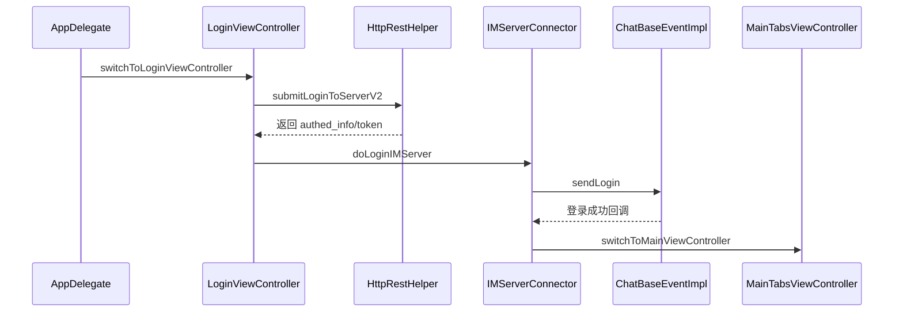
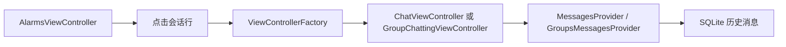

# iOS 客户端 `RainbowChat4i`

## 1. 启动链路

### 1.1 进程入口

应用入口非常标准：

```objc
int main(int argc, char * argv[]) {
    @autoreleasepool {
        return UIApplicationMain(argc, argv, nil, NSStringFromClass([AppDelegate class]));
    }
}
```

这意味着所有启动编排，都统一收口到 `AppDelegate`。

### 1.2 冷启动关键动作

`AppDelegate` 冷启动阶段做的事情，按顺序可以概括成：

1. 初始化语言
2. 尽早初始化 SQLite 单例
3. 注册推送
4. 创建 `window`
5. 切到登录页
6. 延后执行重初始化动作
7. 打开后台拉取

对应代码风格很直接：

```objc
[BasicTool initializeAppLanguage];
(void)[MyDataBase sharedInstance];
self.window = [[UIWindow alloc] initWithFrame:[[UIScreen mainScreen] bounds]];
[self switchToLoginViewController];
[self.window makeKeyAndVisible];
dispatch_async(dispatch_get_main_queue(), ^{
    [self rb_deferredColdStartInitialization];
});
```

### 1.3 为什么这里先初始化数据库

原因不是“顺手做一下”，而是为了避开 FMDB 的首次重入问题。

项目注释已经把这个点说得很直白：

- 如果第一次访问数据库发生在异步回调里
- 并且此时才触发 `sharedInstance`
- 就可能在 `inDatabase` 回调里嵌套初始化
- 最后撞上 FMDB 断言

所以这里是一个非常典型的“先把坑填掉再继续启动”。

## 2. 登录链路

### 2.1 登录不是一步，而是两步

这个项目的登录分成两段：

1. HTTP 登录
2. IM 登录

只有两段都成功，应用才算真正进入可工作状态。

### 2.2 HTTP 登录

发起点在 `LoginViewController`。

它负责：

- 收集账号、密码、验证码、设备信息
- 触发 `HttpRestHelper.submitLoginToServerV2`
- 接收认证结果
- 写入本地登录上下文
- 调起 IM 登录

### 2.3 IM 登录

HTTP 成功后，不是直接进主页，而是交给 `IMServerConnector`。

这里的核心逻辑非常清楚：

```objc
PLoginInfo *loginInfo = [[PLoginInfo alloc] init];
loginInfo.loginUserId = loginUserId;
loginInfo.loginToken = loginToken;
int code = [[LocalDataSender sharedInstance] sendLogin:loginInfo];
```

可以把它理解成：

- HTTP 负责“你是谁、能不能进”
- IM 负责“你进来以后，实时通道能不能连上”

### 2.4 IM 登录成功后发生什么

`IMServerConnector` 收到 IM 登录成功回调后，会做两件很关键的事情：

1. 确保本地数据库已经可用
2. 切到主界面

```objc
if(![MyDataBase sharedInstance])
    DDLogWarn(@"[sqlite-IMServerConnector] 本地sqlite缓存操作封装对象实例化失败。");
[APP switchToMainViewController];
```

### 2.5 真正的“进入在线态”发生在哪

不在登录页，也不在 `AppDelegate`，而是在 `ChatBaseEventImpl` 里。

这里会继续拉：

- 好友列表
- 群列表
- 会话列表
- 离线消息
- 增量同步
- 周期同步
- 设备相关状态

所以“能看到主页”不等于“数据已经补齐”。

## 3. 主界面与导航体系

## 3.1 主容器是什么

主容器是 `MainTabsViewController`。

它不是简单的系统 `UITabBarController` 外壳，而是一个兼容老方案和新方案的自定义根容器。

### 3.2 五个一级入口

当前顶层 5 个页面是：

```objc
return @[ nav1, nav2, nav3, nav4, nav5 ];
```

具体对应：

| Index | 控制器 | 业务含义 |
| --- | --- | --- |
| 0 | `AlarmsViewController` | 私聊会话列表 |
| 1 | `AlarmsViewController` | 群聊会话列表 |
| 2 | `ContactViewController` | 通讯录 |
| 3 | `WalletHomeViewController` | 钱包 |
| 4 | `MoreViewController` | 我的 / 设置 |

### 3.3 为什么会有两个 `AlarmsViewController`

因为它不是单纯的“消息页”，而是通过 `alarmFilterMode` 切成了两个一级入口：

- 私聊入口
- 群聊入口

这说明首页会话体系本身就是按业务类型切开的，而不是单页混排。

### 3.4 新旧导航双实现

主容器兼容两套底部导航：

- 传统 TabBar 方案
- 新的 Swift `FabBar` 方案

这也解释了为什么工程里会出现少量 Swift 文件，但主体依然是 Objective-C。

## 4. UI 架构分析

### 4.1 UI 不是组件树驱动，而是控制器栈驱动

这个项目没有前端那种 Router + Page Config 的概念。

它的 UI 组织方式是：

- 顶层根容器：`MainTabsViewController`
- 每个一级页各有一套 `UINavigationController`
- 页面跳转主要通过 `push/pop`
- 复杂跳转通过 `ViewControllerFactory` 封装

### 4.2 `RootViewController` 的角色

很多主页面不是直接从 `UIViewController` 起步，而是先继承 `RootViewController`。

这个基类统一做了：

- 顶部导航区行为
- 搜索入口
- 加号入口
- 通用 Header 逻辑

所以它更像一个“业务首页通用壳”。

### 4.3 聊天页是“底座 + 业务差异层”

聊天相关页面不是各写各的，而是分了明显两层：

- 公共底座：`gui/chat_root/`
- 单聊差异：`gui/chat_friend/`
- 群聊差异：`gui/chat_group/`
- 临时会话差异：`gui/chat_guest/`

这层划分很关键，因为下面这些能力都是复用底座的：

- 输入栏
- 表情面板
- 引用消息
- 回执
- 撤回
- 音视频通话

## 5. 页面跳转体系

### 5.1 核心思路

没有统一 URL 路由。真正的“路由层”是：

- `NavigationController`
- `ViewControllerFactory`
- 少量 `APP` 全局跳转

### 5.2 `ViewControllerFactory` 解决什么问题

它主要解决三件事：

1. 页面实例化逻辑别散在每个页面里
2. 常见业务页跳转统一收口
3. 某些聊天页可以做“栈内复用”而不是无限新建

### 5.3 这套路由方式的优缺点

| 点 | 结论 |
| --- | --- |
| 好处 | 简单、直观、贴合 Objective-C 老工程 |
| 好处 | 排查跳转路径时落点清楚 |
| 代价 | 路由规则不集中在一个配置文件 |
| 代价 | 深层页面跳转要结合工厂和页面代码一起看 |

## 6. 状态管理方式

### 6.1 没有现代 Store，但有一套老而有效的组合拳

项目主要靠下面几层配合管理状态：

- `IMClientManager`：全局运行时中心
- `Provider`：业务域状态中心
- `NSMutableArrayObservableEx`：可观察集合
- `NotificationCenterFactory`：跨页面广播
- `NSUserDefaults`：轻量持久化状态

### 6.2 `IMClientManager` 是什么

它可以理解成客户端运行时总控。

里面挂着最重要的全局对象：

- 当前用户
- 消息 Provider
- 群消息 Provider
- 会话 Provider
- 好友 Provider
- 群 Provider
- 好友请求 Provider

### 6.3 为什么是 `Provider`，不是直接让页面查库

因为这个项目要同时满足三件事：

- 页面能实时刷新
- 首页能秒开
- 离线后重新进来能恢复

所以策略是：

- 实时展示靠 Provider
- 恢复和兜底靠 SQLite
- 服务端校准靠 HTTP/Sync

### 6.4 UI 刷新怎么发生

典型路径是：

```text
网络事件 -> Helper/Provider 更新内存 -> Observable/Notification -> ViewController 刷新 UI
```

## 7. 典型 UI 调用链

### 7.1 启动到主页



### 7.2 首页会话打开聊天页



## 8. UI 层维护建议

- 新增业务页时，先判断它应该挂在现有 Tab 下，还是一个全新一级入口。
- 如果页面只是聊天能力变体，优先复用 `chat_root`，不要另起一套消息页底座。
- 如果页面需要全局未读、角标、会话刷新，别绕开 `Provider` 直接改 UI。
- 如果新增跳转路径，尽量补进 `ViewControllerFactory`，不要把同一种跳转散落到多个页面里。

## 9. 一句话总结

`RainbowChat4i` 的 UI 架构不是花哨型，而是“根容器 + 导航栈 + Provider + 聊天底座复用”的老派实战型架构。

