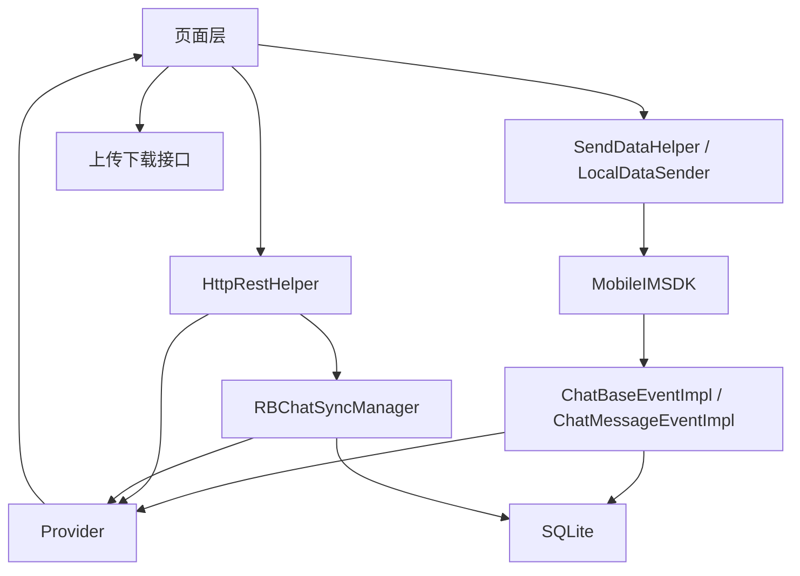
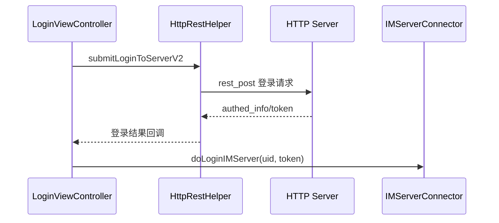
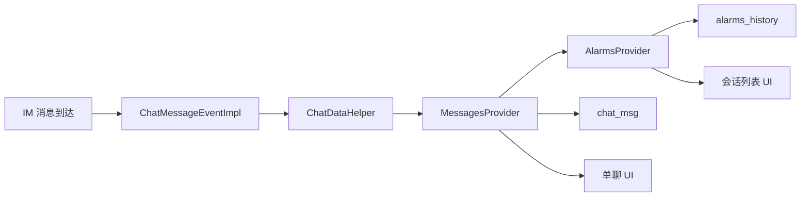
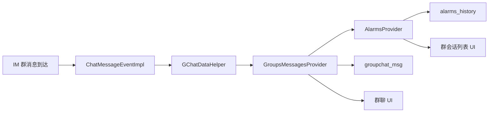
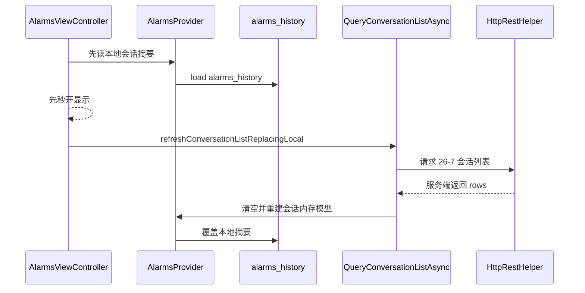

# 网络协议与数据流

## 1. 网络模型总览

这个客户端不是“一个接口打天下”，而是三条链路并行：

- HTTP：登录、资料、好友、群、会话列表、钱包、同步接口
- IM 长连接：实时消息、送达回执、已读回执、在线态
- 文件接口：图片、语音、头像、大文件、短视频上传下载

可以把它想成：



## 2. HTTP 调用链

### 2.1 统一入口

HTTP 层真正的总入口是 `HttpRestHelper`。

这个类不是单一业务 Helper，而是整个客户端的 REST 门面。它管的范围非常大：

- 登录
- 好友
- 群组
- 会话列表
- 已读状态
- 钱包
- 红包
- 转账
- 上传下载元数据
- SyncKey 增量同步

### 2.2 HTTP 调用基本模式

大体就是下面这个套路：

```text
ViewController / Manager
  -> HttpRestHelper
  -> HttpService / Processor / action
  -> 服务端返回 JSON
  -> 回调到页面或管理器
```

### 2.3 登录接口链路



## 3. IM 调用链

### 3.1 IM 负责什么

IM 长连接不负责全部业务，它主要负责：

- 登录到实时通道
- 收实时消息
- 收已读、送达、撤回之类的实时状态
- 连接断开、重连、踢下线

### 3.2 IM 登录链路

IM 登录桥接层是 `IMServerConnector`。

核心动作很简单：

1. 先设置登录结果观察者
2. 再调用 `sendLogin`
3. 由 `ChatBaseEventImpl` 处理登录结果

这条链路说明 IM 层是事件驱动，不是同步调用拿结果。

### 3.3 IM 发送链路

普通消息发送不是页面直接调 SDK，而是：

```text
聊天页 -> SendDataHelper -> LocalDataSender -> MobileIMSDK
```

这么做的好处是：

- 页面不用管底层协议细节
- 发送路径能统一挂 QoS、日志、状态回写
- 后续不同消息类型能复用一套发送收口

## 4. 实时消息数据流

### 4.1 单聊消息



### 4.2 群聊消息



## 5. 会话列表调用链

### 5.1 首页不是直接查消息表

这是理解这个项目最关键的点之一。

首页会话列表主要靠的是：

- `AlarmsProvider` 内存模型
- `alarms_history` 本地摘要表
- 服务端 26-7 会话列表接口

也就是说：

- 消息正文主要在 `chat_msg` / `groupchat_msg`
- 首页摘要主要在 `alarms_history`

### 5.2 首屏会话列表怎么来



## 6. 已读、送达、撤回链路

### 6.1 已读

已读这块不是一个点，而是一整套闭环：

- 聊天页进入时查询对方已读水位
- 聊天页退出或阅读后主动上报已读
- IM 层也会收到实时已读事件
- Provider 刷新内存状态
- SQLite 回写 `read_by_partner`
- UI 更新双勾和会话未读

### 6.2 送达

送达链路是：

```text
消息发送 -> 服务端 ACK / MT63 -> ChatMessageEventImpl -> Provider 标记 delivered -> SQLite 更新 send_status
```

### 6.3 撤回

撤回不是简单删 UI，而是：

- 收到撤回事件
- 更新内存消息对象
- 更新数据库状态
- 更新会话摘要预览

## 7. API 调用链说明

| 业务 | 页面入口 | 网络入口 | 下游落点 |
| --- | --- | --- | --- |
| 登录 | `LoginViewController` | `submitLoginToServerV2` | `IMServerConnector` |
| 会话列表 | `AlarmsViewController` | `QueryConversationListAsync` | `AlarmsProvider` |
| 离线消息 | `AppDelegate` / `ChatBaseEventImpl` | `QueryOfflineChatMsgAsync` | `ChatDataHelper` / `GChatDataHelper` |
| 增量同步 | `RBChatSyncManager` | SyncKey HTTP 接口 | Provider + SQLite |
| 已读确认 | 聊天页 | 1008-4-24 / 1008-4-25 | Provider + SQLite |
| 发消息 | 聊天页 | `SendDataHelper` | IM 长连接 |
| 钱包 | 钱包页 | `HttpRestHelper` | 页面本身或相关业务对象 |

## 8. 文件上传下载链路

项目把普通 JSON 接口和文件接口分开了。

主要有这些独立入口：

- `BinaryDownloader`
- `MsgImageUploader`
- `MsgVoiceUploader`
- 头像上传
- 大文件上传下载
- 短视频上传下载

这意味着媒体类问题排查时，不能只盯着 `rest_post`。

## 9. 典型排障思路

### 9.1 登录失败

先判断卡在哪一层：

1. HTTP 请求没发出去
2. HTTP 返回失败
3. IM 登录请求没发出去
4. IM 登录回调没回来
5. IM 登录成功了，但后续补齐动作失败

### 9.2 会话列表不对

按这个顺序看：

1. `QueryConversationListAsync` 是否调用
2. `26-7` 返回是否正确
3. `AlarmsProvider` 是否重建成功
4. `alarms_history` 是否被正确覆盖
5. 本地未读和服务端未读是否冲突

### 9.3 聊天页消息不对

按这个顺序看：

1. `ChatMessageEventImpl` 是否收到消息
2. `ChatDataHelper` / `GChatDataHelper` 是否正确分流
3. Provider 是否去重成功
4. SQLite 是否写入成功
5. 当前页面是否正确订阅了 Provider

## 10. 一句话总结

网络层真正的关键，不是“有哪些接口”，而是“HTTP 负责业务，IM 负责实时，Sync 负责补偿，SQLite 负责兜底”。

