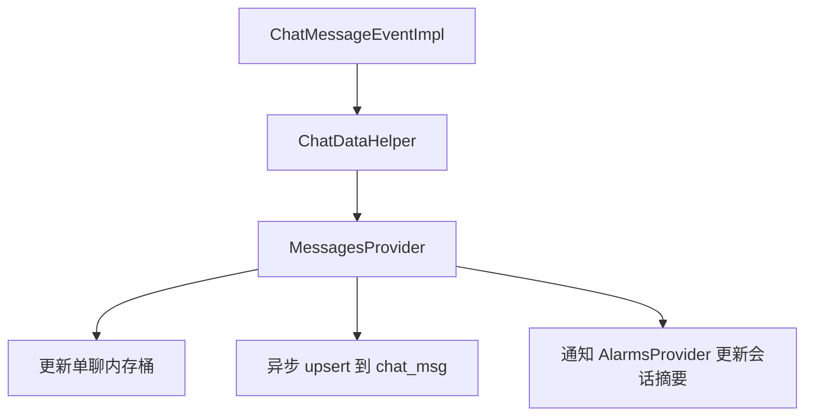
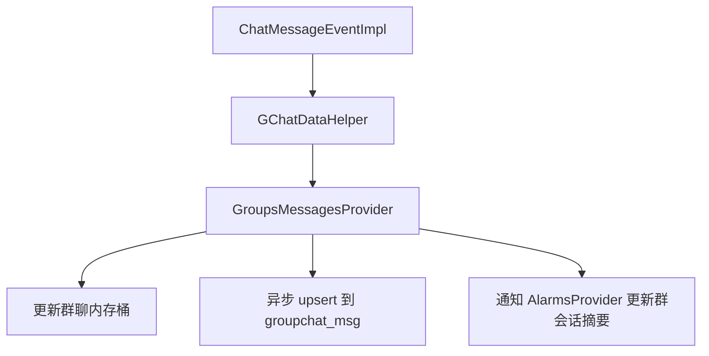
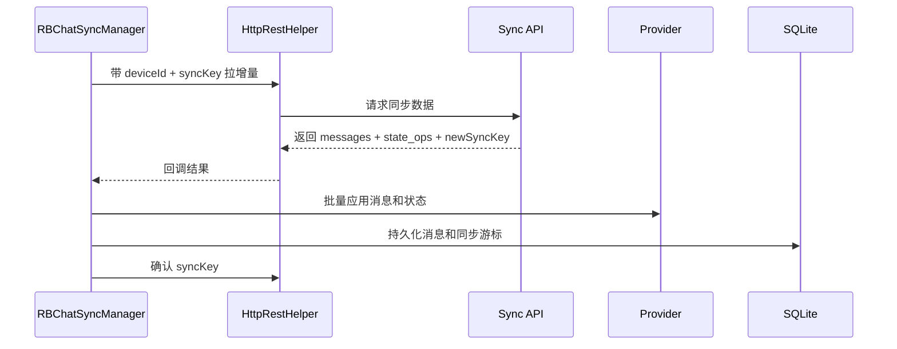

# 本地存储与同步机制

## 1. 先说结论

这个项目的数据不是“从服务端拿来直接展示”，而是四层一起工作：

1. Provider 内存态
2. SQLite 本地库
3. 离线消息拉取
4. SyncKey 增量同步

如果只看其中一层，很容易误判问题。

## 2. 本地数据库总入口

数据库总入口是 `MyDataBase`。

它负责：

- 创建数据库队列
- 初始化表对象
- 建表
- 做表结构迁移
- 补索引和补字段

## 3. 主要数据表职责

| 表 / 表对象 | 作用 | 关键内容 |
| --- | --- | --- |
| `chat_msg` / `ChatHistoryTable` | 单聊消息历史 | fp、sender、text、msgType、send_status、read_by_partner |
| `groupchat_msg` / `GroupChatHistoryTable` | 群聊消息历史 | gid、fp、parentFp、状态字段 |
| `alarms_history` / `AlarmsHistoryTable` | 会话摘要表 | 标题、预览、未读、置顶、归档、@我、排序 |
| `call_records_cache` | 通话记录缓存 | 通话场景使用 |
| `QuoteFields` | 引用消息扩展字段 | 引用消息能力配套 |

## 4. 为什么要把“消息正文”和“会话摘要”拆开

因为这两种数据的使用方式完全不同：

| 数据类型 | 用途 |
| --- | --- |
| 消息正文 | 打开聊天页时看历史内容 |
| 会话摘要 | 首页秒开、未读、排序、置顶、归档 |

如果首页每次都从消息表现算：

- 查询重
- 排序复杂
- 未读聚合麻烦
- 首屏速度差

所以项目专门维护了一张摘要表 `alarms_history`。

## 5. Provider 和 SQLite 的关系

### 5.1 Provider 负责当前活数据

它是页面直接看的那份数据。

### 5.2 SQLite 负责恢复和兜底

它负责下面这些场景：

- App 冷启动秒开
- 页面重进恢复历史
- 网络不好时仍能看到旧数据
- 异常退出后数据不全丢

### 5.3 正确理解方式

```text
Provider = 当前活状态
SQLite = 持久化底座
服务端列表/同步 = 权威校准
```

## 6. 单聊消息落库链路



### 6.1 关键特点

- 不是先写库再显示，而是先更新内存、再异步写库。
- 去重主键是消息指纹 `fp`。
- 已读、送达、撤回这些状态后续会回写，不一定在第一次写入时就完整。

## 7. 群聊消息落库链路



### 7.1 群聊与单聊的额外差异

群聊除了普通 `fp`，还会额外处理 `parentFp` 之类的稳定标识，目的是让：

- 群消息合并更稳定
- 撤回和引用定位更准确
- 漫游和补偿消息去重更稳

## 8. 会话列表存储逻辑

### 8.1 冷启动先读本地

首页会先从 `alarms_history` 读一版本地会话摘要，目的是秒开。

### 8.2 再用服务端结果校准

后面再通过 `QueryConversationListAsync` 调 `26-7` 接口，把：

- 会话顺序
- 服务端未读
- 会话最新摘要
- 置顶等状态

重新应用到 `AlarmsProvider` 和本地库。

### 8.3 这意味着什么

会话列表的“最终权威”，不是本地消息表，而是：

- 本地摘要表 + 服务端会话列表 + 同步补丁

## 9. 旧离线拉取链路

项目里保留着一套典型的离线消息补偿机制：

- 登录成功后或回前台后触发
- 请求服务端离线消息包
- 按单聊 / 群聊分流
- 复用实时消息入库逻辑

这条链路主要解决：

- 用户离线期间收到的消息
- 重连后快速补齐缺口

## 10. SyncKey 增量同步链路

### 10.1 `RBChatSyncManager` 解决什么问题

它解决的是“只靠离线包还不够”的那些问题，比如：

- 多端一致性
- 已读状态同步
- 会话未读重算
- 页面状态补丁
- 周期性增量拉取

### 10.2 SyncKey 管什么

本地会保存一组和同步相关的状态：

- `deviceId`
- `syncKey`
- 一些 `state_ops` 游标

它不是简单地记“上次同步时间”，而是按设备维度维护增量游标。

### 10.3 SyncKey 基本数据流



### 10.4 `state_ops` 是什么

从现有代码看，`state_ops` 主要用来同步那些“不是消息正文，但会影响界面状态”的操作。

当前最典型的是：

- 已读回执相关状态

## 11. 已读与送达的本地回写

### 11.1 已读

聊天页会维护对方已读水位线。

当满足条件时，会：

- 更新内存消息状态
- 批量更新数据库里的 `read_by_partner`
- 清理会话未读
- 刷新 UI 双勾

### 11.2 送达

当收到送达 ACK 后，会：

- 标记消息 `send_status`
- 更新 Provider
- 更新 SQLite

这一步很重要，因为如果只改内存，不改库，下次读历史又会显示“发送中”。

## 12. 数据一致性原则

### 12.1 当前工程的实际做法

| 层 | 作用 | 是否权威 |
| --- | --- | --- |
| 页面临时状态 | 当前屏幕显示 | 否 |
| Provider | 当前运行时主状态 | 部分权威 |
| SQLite | 本地恢复基线 | 部分权威 |
| 服务端会话列表 / Sync | 最终校准 | 是 |

### 12.2 排查一致性问题的顺序

1. 先看服务端是否返回了正确数据。
2. 再看 Provider 是否应用成功。
3. 再看 SQLite 是否被正确回写。
4. 最后才看 UI 有没有订阅到更新。

## 13. 常见问题定位表

| 现象 | 优先排查 |
| --- | --- |
| 会话未读不对 | `QueryConversationListAsync`、`AlarmsProvider`、SyncKey 返回的 unread |
| 聊天页消息丢失 | `ChatMessageEventImpl`、Provider 去重、SQLite upsert |
| 双勾状态不对 | 已读上报、已读回执事件、`read_by_partner` 回写 |
| 发送状态一直转圈 | MT63 / ACK 是否到达、`send_status` 是否更新 |
| 冷启动首页空白 | `alarms_history` 是否加载、Provider 是否初始化 |

## 14. 一句话总结

本地存储和同步这块，最重要的认知不是“有没有 SQLite”，而是“内存、本地库、离线补偿、SyncKey 校准是一起工作的”。

