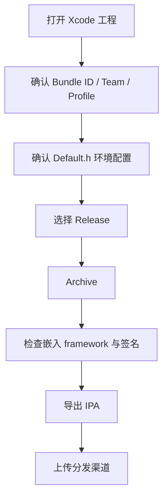

# 依赖关系与运行方式

## 1. 构建方式总览

当前项目的构建方式非常明确：

- 用 Xcode 打开 `RainbowChat4i.xcodeproj`
- 依赖由工程手工集成
- 没有 Podfile
- 没有 Swift Package 清单
- 没有 Fastlane
- 没有现成 CI 配置

也就是说，这不是“装一下依赖就能跑”的项目，而是“Xcode 工程环境必须配齐”的项目。

## 2. 运行前置条件

### 2.1 本地环境

- macOS
- Xcode
- iOS 17.0+ SDK
- 有效的 Apple 签名能力
- 真机或可用模拟器环境

### 2.2 外部服务

客户端跑起来至少依赖下面这些外部能力：

- HTTP 业务接口
- IM 长连接服务
- 文件上传下载接口
- 推送能力
- Agora 相关能力
- 地图 key

### 2.3 本地关键配置文件

| 文件 | 作用 |
| --- | --- |
| `Default.h` | 业务地址、AppKey、Agora、地图 key、上传下载地址 |
| `Info.plist` | 权限、后台模式、URL Scheme、系统能力 |
| `RainbowChat4i.entitlements` | Release 推送和能力配置 |
| `RainbowChat4i-Debug.entitlements` | Debug 推送和能力配置 |
| `project.pbxproj` | 编译设置、依赖、签名、framework 嵌入 |

## 3. 环境配置重点

### 3.1 服务端地址

当前代码里直接写在 `Default.h`：

```objc
#define HTTP_SERVER_URL @"http://47.83.125.166:8081/rainbowchat_pro/"
#define IM_SERVER_IP    @"47.83.125.166"
#define IM_SERVER_PORT  9903
#define IM_SERVER_IP_LIST @[IM_SERVER_IP]
```

这意味着迁移环境时，最先要核对的不是页面代码，而是这些地址是不是对的。

### 3.2 业务密钥和三方配置

`Default.h` 还直接放了下面这些内容：

- `APPKey`
- Agora AppId
- 高德地图 key
- 上传下载接口根地址
- 隐私协议、FAQ 等页面地址

如果要做正式交付或开源整理，第一件事就是脱敏。

### 3.3 运行模式开关

项目里还有一类很关键的编译期 / 配置期开关，比如单机无漫游模式。

这会直接影响：

- 是否启用完整同步逻辑
- 是否依赖会话漫游
- 是否还需要某些服务端返回字段

## 4. 工程依赖分析

### 4.1 系统框架

Xcode 工程直接链接了不少系统能力，包括但不限于：

- PushKit
- CallKit
- UserNotifications
- AVFoundation
- CoreLocation
- CoreTelephony
- Vision
- SwiftUI
- UniformTypeIdentifiers

### 4.2 三方库和二进制

从工程配置和目录可以看出，项目手工集成了：

- MobileIMSDK 静态库
- Agora `xcframework`
- 高德地图 framework
- AFNetworking
- FMDB
- Masonry
- SDWebImage
- JSQMessages
- LBXScan
- IQAudioRecorder
- 其他工具和 UI 组件

### 4.3 依赖组织方式的特点

| 点 | 结论 |
| --- | --- |
| 好处 | 不依赖外部包管理器，交付时比较直给 |
| 坏处 | 工程迁移、升级依赖、修复签名都偏人工 |
| 风险 | 某个 framework 丢了、路径错了，工程会直接编不过 |

## 5. 工程启动流程

### 5.1 本地启动步骤

1. 打开 `RainbowChat4i.xcodeproj`
2. 选择 `RainbowChat4i` Scheme
3. 检查 Signing & Capabilities
4. 核对 `Default.h` 中的环境地址和 key
5. 选择真机或模拟器
6. Build 并运行

### 5.2 首次运行成功的最小闭环

```text
App 启动
-> 进入登录页
-> HTTP 登录成功
-> IM 登录成功
-> 进入主 Tabs
-> 拉到会话列表
-> 发送一条文本消息
```

只要这个闭环能跑通，说明基础运行链路是通的。

## 6. 发版 / 部署流程

### 6.1 当前仓库可推断的发版方式

因为仓库里没有自动化流水线配置，所以当前更像传统 iOS 发版流程：

1. 在 Xcode 中切到 Release
2. 处理签名和 Provisioning Profile
3. Archive
4. 导出 IPA
5. 手工上传到 TestFlight、App Store 或企业分发渠道

### 6.2 建议的发版检查表

| 检查项 | 为什么要看 |
| --- | --- |
| Bundle ID | 当前工程里 Debug / Release 都有历史痕迹 |
| Team / Profile | 手工签名模式最容易错 |
| Entitlements | Debug 和 Release 推送环境不同 |
| Agora 动态库嵌入 | 不一致会导致导出失败或运行崩溃 |
| `Default.h` 地址和 key | 测试环境误带到生产会直接出事故 |
| 权限描述文案 | 审核和运行都依赖它 |

### 6.3 Mermaid 发版流程图



## 7. 运维视角需要知道什么

虽然这是客户端工程，但运维或交付同学至少要知道下面这些依赖：

- HTTP 服务地址在哪里写
- IM 地址和端口在哪里写
- 上传下载接口走哪些路径
- APNs/VoIP/CallKit 需要哪些能力
- Agora 和地图 key 是否匹配环境

## 8. 常见运行问题

### 8.1 工程能打开但运行闪退

优先排查：

- framework 嵌入和签名
- 权限能力缺失
- 某个环境 key 无效
- 某些动态库在目标设备上没被正确加载

### 8.2 能打开登录页但登不上

优先排查：

- `HTTP_SERVER_URL`
- `IM_SERVER_IP` 和 `IM_SERVER_PORT`
- `APPKey`
- HTTP 是否返回 token
- IM 登录是否成功回调

### 8.3 登录成功但首页数据空

优先排查：

- `ChatBaseEventImpl` 登录后补齐逻辑
- `QueryConversationListAsync`
- `RBChatSyncManager`
- 本地库初始化是否正常

## 9. 长期维护建议

- 把环境配置逐步从 `Default.h` 抽到更清晰的环境文件。
- 把签名和 Archive 流程文档化，不要只留在本地经验里。
- 把关键三方依赖版本和来源单独做清单，降低换机成本。
- 后续如果要持续交付，优先补 CI 和自动化打包。

## 10. 一句话总结

这个项目的运行门槛，不在业务代码本身，而在“Xcode 手工工程 + 外部服务 + 历史配置痕迹”这三件事叠在一起。

